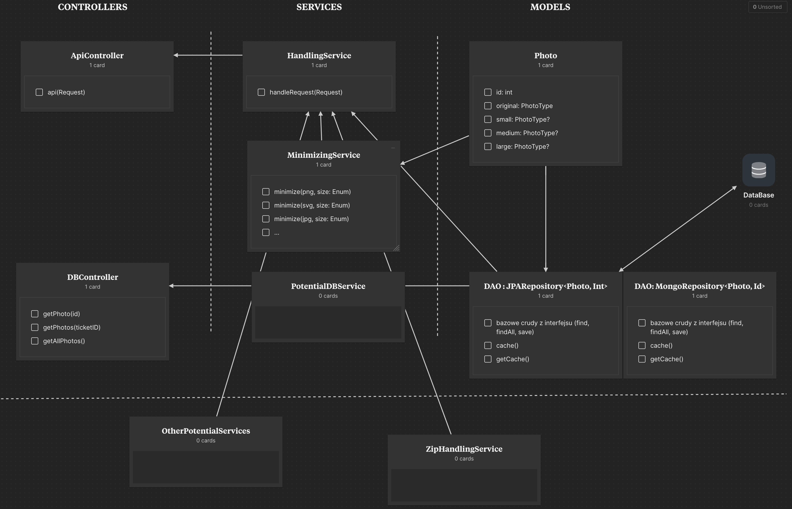
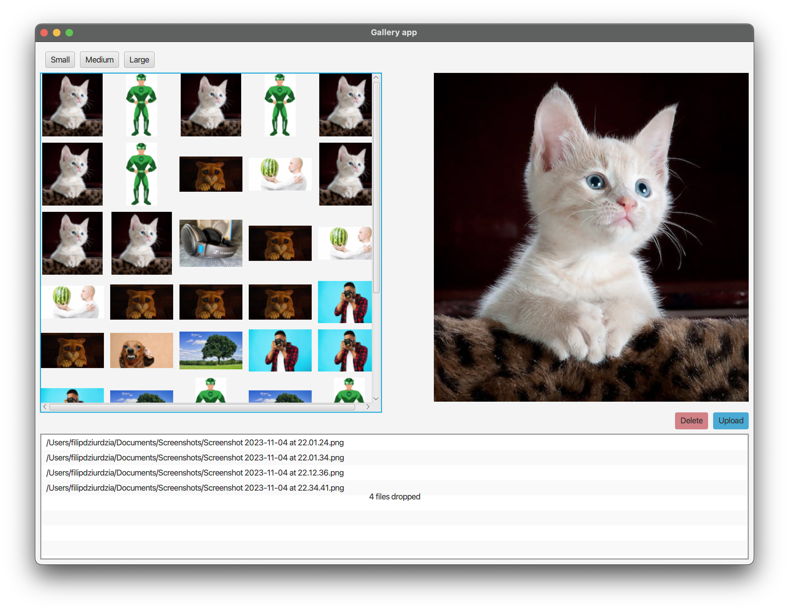

# Changelog

## M1 - 15.12.2023

- **Inicjalizacja projektu**
- **Podpięcie testowej bazy H2**
- **Zrealizowanie architektury**
  
- **Dodanie przyjmowania pojedynczego zdjęcia w requeście**
- **Dodanie zapisywania zdjęć w bazie**
- **Dodanie GET endpointów do pobierania zdjęć z bazy**
- **Dodanie przyjmowania wielu zdjęć w requeście**
- **Dodanie tworzenia miniatur**
- **Dodanie reaktywnego przetwarzania wysłanych zdjęć**

## Najbliższe plany
- **Zmiana bazy H2 na docelową bazę aplikacji**
- **Stworzenie cache'u po stronie bazy, aby uodpornić aplikację na crash'e**
- **Frontend i komunikacja**
- **Dodanie testów**
- **Dodanie rozróżnienia w odpowiedzi endpoitów czy proces zmiejszania obrazu się nie powiódł, czy jeszcze nie został wykonany**

## M2 05.01.2024

- **Stworzenie frontu w JavaFX**
- **Podpięcie bazy MongoDB w chmurze**
- **Aplikacja backendowa po wstaniu sprawdza czy zostały jakieś nieprzeprocesowane zdjęcia**
- **Odświeżanie frontu co 2s względem bazy**
- **Wybór miniatur po rozmiarze**
- **Podgląd oryginalnego zdjęcia**
- **Placeholder po stronie frontu podczas przetwarzania zdjęcia**
- **Dodawanie plików do aplikacji frontendowej poprzed drag & drop**
- **Wysyłanie zdjęć do zminimalizowania dodanych we froncie**

## Instrukcje

Aby cały projekt zadziałał, należy włączyć zarówno backend oraz osobno frontend. Po wysłaniu ~5 plików możemy zaobserwować placeholdery w miejscach jeszcze nieprzetworzonych obrazków.

## Najbliższe plany

- **Dodanie do komunikacji message brokera, żeby front dostawał informację kiedy coś zostało zapisane do bazy żeby się zaktualizował**
- **Wymagania M3**

  

## Endpointy

### 1. Upload plików - saveImages

- **Metoda:** `POST`
- **Parametry:** `files` (List\<MultipartFile\>) - lista przesyłanych plików
- **Opis:** Endpoint umożliwiający przesyłanie wielu plików. Po wysłaniu plików, aplikacja tworzy bilet w bazie danych, przetwarza pliki za pomocą `HandlingService` i zwraca odpowiedź.

### 2. Pobieranie wszystkich zdjęć - getAllImages

- **Metoda:** `GET`
- **Opis:** Endpoint umożliwiający pobieranie całej bazy. Zwraca odpowiedź zawierającą obiekty ImageResponse.

### 3. Pobieranie zdjęcia po identyfikatorze - getImageById

- **Metoda:** `GET`
- **Ścieżka:** `/{id}`
- **Parametry:** `id` (String) - identyfikator wpisu w bazie
- **Opis:** Endpoint umożliwiający pobranie obiektu ImageResponse o określonym identyfikatorze.

### 4. Pobranie wszystkich małych miniatur - getAllSmallImages

- **Metoda:** `GET`
- **Ścieżka:** `/small/photos`
- **Opis:** Endpoint umożliwiający pobranie wszystkich małych miniatur w bazie.

### 5. Pobranie wszystkich średnich miniatur - getAllMediumImages

- **Metoda:** `GET`
- **Ścieżka:** `/medium/photos`
- **Opis:** Endpoint umożliwiający pobranie wszystkich średnich miniatur w bazie.

### 6. Pobranie wszystkich dużych miniatur - getAllLargeImages

- **Metoda:** `GET`
- **Ścieżka:** `/large/photos`
- **Opis:** Endpoint umożliwiający pobranie wszystkich dużych miniatur w bazie.

### 7. Pobieranie małej miniatury po identyfikatorze - getSmallImageById

- **Metoda:** `GET`
- **Ścieżka:** `/small/{id}`
- **Parametry:** `id` (String) - identyfikator wpisu w bazie
- **Opis:** Endpoint umożliwiający pobranie małej miniatury o określonym identyfikatorze.

### 8. Pobieranie średniej miniatury po identyfikatorze - getMediumImageById

- **Metoda:** `GET`
- **Ścieżka:** `/medium/{id}`
- **Parametry:** `id` (String) - identyfikator wpisu w bazie
- **Opis:** Endpoint umożliwiający pobranie średniej miniatury o określonym identyfikatorze.

### 9. Pobieranie dużej miniatury po identyfikatorze - getLargeImageById

- **Metoda:** `GET`
- **Ścieżka:** `/large/{id}`
- **Parametry:** `id` (String) - identyfikator wpisu w bazie
- **Opis:** Endpoint umożliwiający pobranie dużej miniatury o określonym identyfikatorze.
